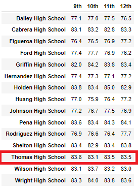
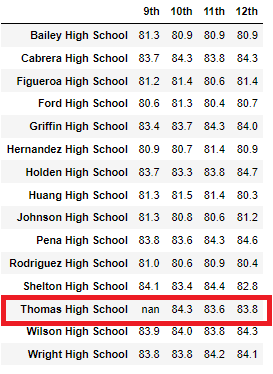

# School District Analysis

## Overview of the School District Analysis
We are advising Maria, the Chief Data Scientist of a school district, in cleansing, preparing and analyzing data from standardized tests of the schools of the school district she covers. With the former she will be able to identify performance trends and patterns that will be useful to lead discussions and strategic decisions at school and district level.
In this specific analysis, Maria and her supervisor were notified that there is evidence of academic dishonesty; specifically, reading and math grades for Thomas High School ninth graders appear to have been altered. Therefore, we will cleanse the data set by removing both reading and math grades of Thomas High School ninth graders (the “Adjustment”).
After cleansing the data set, we will show a comparison of the results of the School District Analysis, with and without the Adjustment. The results that we will show are:
- District Summary 
- School Summary
- School Performance Ranking
- Average math and reading scores for each grade level from each school
- Schools scores breakdown by: Spending per student, size and type

## School District Analysis Results
##District Summary
The District Summary had changes in the following items: Average math score, % passing math, % passing reading and % overall passing. However, differences at the aggregate level do not seem material.

Below you will find a comparison for such items in both scenarios.

Prior to Adjustment:

After Adjustment:

###School Summary
The School Summary only had changes in the Thomas High School items, since it was the only school which data was cleansed. Specifically, the changes are in the average math and reading scores, as well as the % passing math, % passing reading and % overall passing. However, differences do not seem material.

Below you will find a comparison of the school summary in both scenarios.

Prior to Adjustment:

After Adjustment:

##School Performance Ranking
There was no change in the position of Thomas High School in the school ranking, it remained as the second-best school in the district, despite that its % overall passing score decreased from 90.94% to 90.63%. Below you will find a comparison of the top 5 schools in both scenarios.

Prior to Adjustment:

After Adjustment:

###Average math and reading scores for each grade level from each school
In both scenarios, there were no changes in the average math and reading scores for each grade level from each school; with the exception of Thomas High School which 9th graders average math and reading scores appear as *nan* after the Adjustment (no changes for 10 to 12th graders average math and reading scores).

Prior to Adjustment:

*Average Reading Scores*

*Average Math Scores*

After Adjustment:

*Average Reading Scores*

*Average Math Scores*

### Schools scores breakdown by: Spending per student, size and type
In both scenarios and the three types of breakdowns (i.e. spending per student, size and type) there were no changes in the average math and reading scores, % passing math, % passing reading and % overall passing. 

Below you will find the summary figures in both scenarios for the three types of breakdowns:

*School Spending per Student*

*School Size*

*School Type*

## School District Analysis Summary

After reading and math scores for the ninth grade at Thomas High School were replaced with *nans*, the main four changes of our analysis are:
1.	The District Summary had changes in the average math score, % passing math, % passing reading and % overall passing
2.	The School Summary only had changes in the Thomas High School items, since it was the only school which data was adjusted. Specifically, the changes are in the average math and reading scores, % passing math, % passing reading and % overall passing
3.	Thomas High School % overall passing score decreased from 90.94% to 90.63%, however it remained as the second-best school in the district, despite that its % overall passing score decreased from 90.94% to 90.63%
4.	Thomas High School 9th graders average math and reading scores appear as *nan* and there were no changes for 10 to 12th graders average math and reading scores

